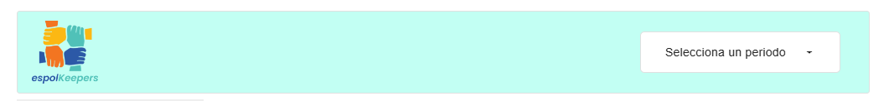
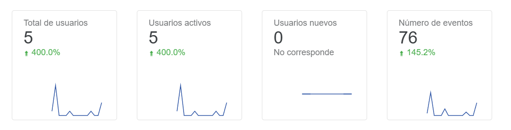
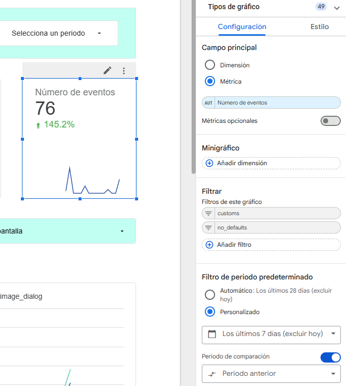
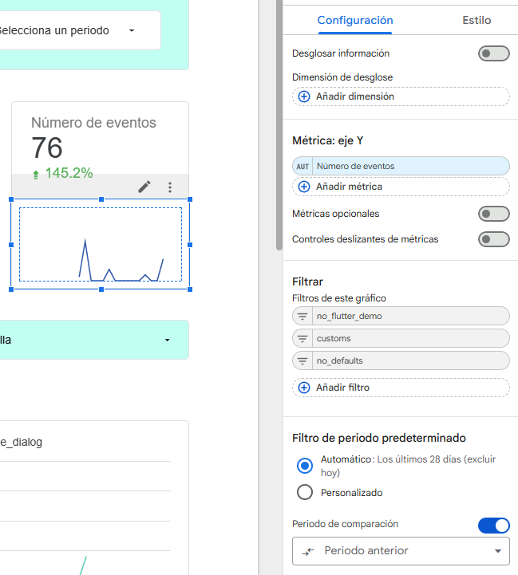
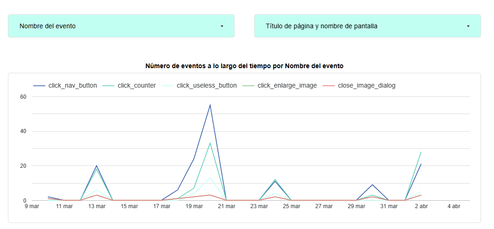
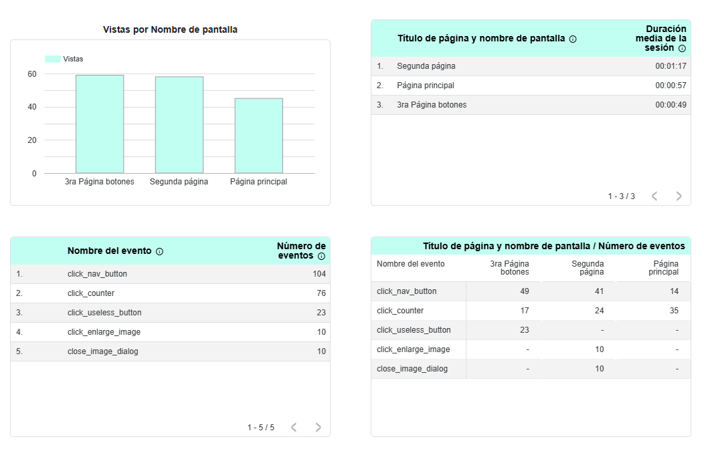

# Documentación del Dashboard de Analítica

> [!NOTE]
> Los colores y la estructura visual del dashboard pueden diferir respecto al diseño original.

> [!WARNING]
> En las configuraciones encontrarás filtros como "customs", "no_defaults" o "no_flutter_demo". Estos excluyen eventos no personalizados. Se recomienda crear un filtro específico para eventos que comiencen con "click_", siguiendo la guía de eventos.

---

## Estructura general

El dashboard inicia con una barra superior que incluye el logo de EspolKeepers y un filtro de fechas.

---

## Indicadores principales

Cada indicador muestra un valor clave, un minigráfico y un filtro de periodo predeterminado.

- Ejemplo de indicadores:

- Configuración de un indicador:

- Configuración del minigráfico:

---

## Filtros y selectores

El dashboard incluye selectores para:

- Nombre de evento
- Título de página y nombre de pantalla

Estos permiten filtrar la serie de tiempo que muestra la cantidad de eventos por día.

---

## Gráficos y tablas

La sección final incluye:

- Un gráfico de vistas por nombre de pantalla.
- Tres tablas:
	1. Retención por pantalla (tiempo medio de sesión).
	2. Cantidad de veces que se registró cada evento.
	3. Cantidad de eventos por nombre y por ventana/pantalla.

---

> [!TIP]
> Para un análisis más preciso, asegúrate de que los eventos estén correctamente nombrados y filtrados según las convenciones establecidas en la documentación de eventos.

